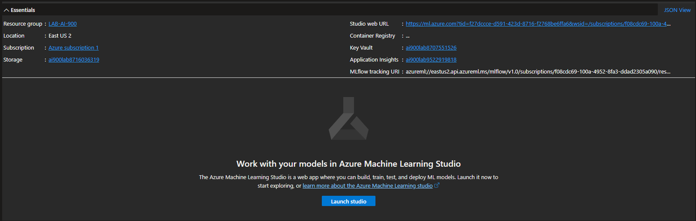
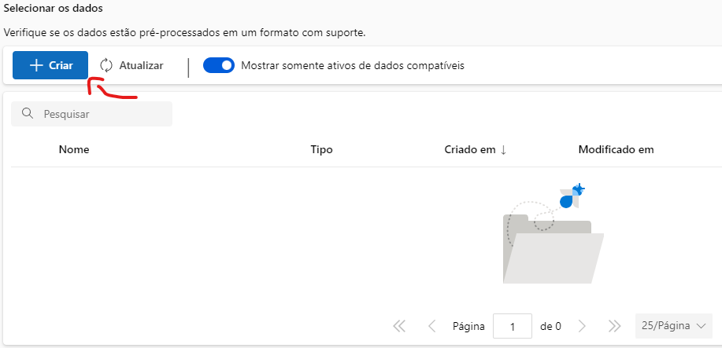
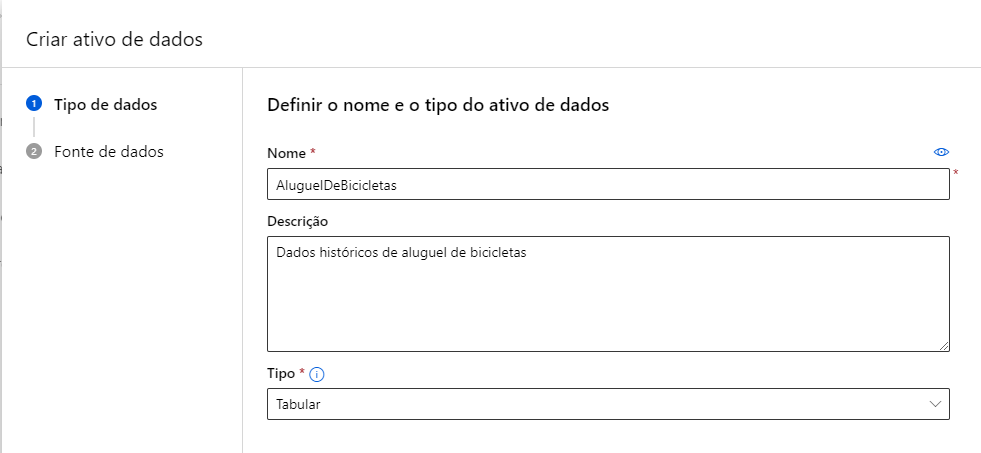

# Passo a Passo de Utilização do Serviço Azure Machine Learning

## Requisitos

- [x] Conta no Azure

## Passo a Passo

1. Acesse o portal do Azure e clique em "Create" no canto superior esquerdo da sua home.

2. No campo de busca, digite "Machine Learning" e clique em Create no card "Azure Machine Learning".

3. Selecione um Resource Group ou crie um novo. Preencha o nome do workspace (campo destacado em rosa) e clique em "Review + Create".

4. Aguarde a validação e clique em "Create".

5. Após a criação do recurso, acesse o workspace criado e clique em "Launch studio".

6. No Azure Machine Learning Studio, clique em "ML automatizado" no menu lateral esquerdo.

7. Clique em "Novo trabalho de ML automatizado".

8. Preencha os campos obrigatórios e clique em "Avançar".
    - Nome do trabalho
    - Nome do experimento
    - Descrição

9. Selecione o tipo de tarefa, no caso "Regressão" e adicione o conjunto de dados cicando em "+ Criar".

    9.1. Dê um nome e descrição ao conjunto de dados, selecione o tipo e clique em "Avançar".
    

    9.2 Selecione o tipo de fonte dos dados, no caso, será utilizado uma fonte "De arquivos da Web". Clicando em avançar, preencha o URL do arquivo e clique em "Avançar".
    

    9.3 Verifique se as configurações estão corretas, se julgar necessário, é possível ter uma visualização dos dados na integra clicando em "Examinar", após clique em "Avançar".
    

    9.4 Verifique se as colunas estão corretas e com a tipagem de acordo, se necessário faça os devidos ajustes e clique em "Avançar".

    9.5 Valide as configurações e clique em "Criar".
    

10. Após a criação do conjunto de dados, selecione o mesmo e clique em "Avançar".

